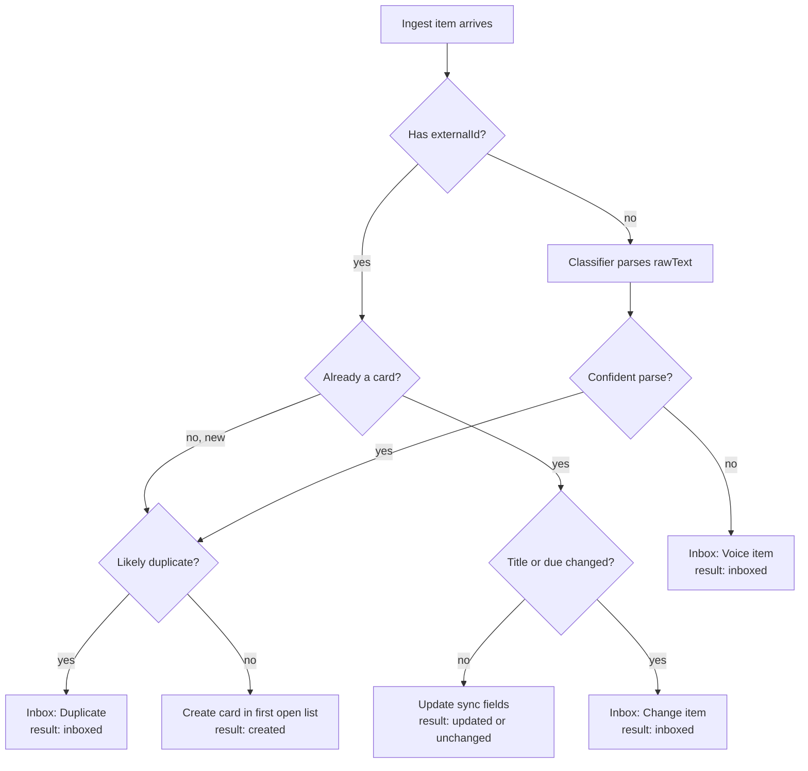

# notes-app — Backend & API Spec

Oct 6, 2026 · Tanvir Jawad

## Overview and conventions

The backend is a Go + Gin JSON API over MySQL 8, served under `/api`. Each server belongs to one user, who signs in with a password; scrapers and other tools use named API tokens. It is built in two phases: first every handler returns fixture data so the UI can be built against it, then routes switch to MySQL one at a time. The database is defined in `schema.sql`; the UI it serves is defined in `ui-frontend-spec.md`.

**Terms** (same as the schema and UI spec)

| Term | Meaning | Table |
| --- | --- | --- |
| Board | A fully separate set of cards, e.g. Fall 2026, Personal | `boards` |
| List | A board's column; kind is `open` or `done` | `lists` |
| Card | A single item on a board | `cards` |
| Tag | A per-board label with one palette color | `tags` |
| Special Tag | A tag with `isSpecial: true`; shown in the sidebar and as chips; at most one per card | `tags` |
| Source | Where a card came from: webwork, autolab, voice, syllabus, manual | `sources` |
| Inbox item | Something waiting for a human decision | `inbox_items` |

**Conventions**

- **Auth:** every `/api` route requires `Authorization: Bearer <token>`, where the token is a session token from login or an API token (see Auth). Missing, unknown, revoked, or expired → 401. The open routes are `GET /healthz`, `GET /api/auth/status`, `POST /api/auth/setup`, and `POST /api/auth/login`.
- **Config:** `NOTES_ADDR` is the listen address (default `127.0.0.1:8080`; set `0.0.0.0:8080` to accept other devices). `NOTES_PASSWORD` optionally sets the password from the environment (see Auth).
- **JSON:** request and response bodies use camelCase keys; ids are numbers; absent optional values are `null`, not omitted.
- **Time:** every timestamp is an ISO 8601 UTC string, e.g. `"2026-10-09T03:59:00Z"`. A card's `dueAllDay: true` means only the date part matters; the client renders all times in the user's local zone.
- **Partial updates:** PATCH bodies contain only the fields being changed.
- **Lists from collection routes** return a bare JSON array unless a section says otherwise.

**Errors** always use one shape: `{"error": {"code": "LIST_HAS_CARDS", "message": "...", "details": {...}}}`.

| Code | HTTP | When |
| --- | --- | --- |
| `UNAUTHORIZED` | 401 | Missing, unknown, revoked, or expired bearer token |
| `INVALID_PASSWORD` | 401 | Wrong password on login or password change |
| `INVALID_SETUP_CODE` | 401 | Wrong setup code on first-run setup |
| `SETUP_REQUIRED` | 409 | Login attempted before a password exists |
| `ALREADY_SET_UP` | 409 | Setup attempted when a password already exists |
| `PASSWORD_FROM_ENV` | 409 | Password change attempted while `NOTES_PASSWORD` is set |
| `RATE_LIMITED` | 429 | Too many failed password or setup-code attempts; `details.retryAfterSeconds` |
| `NOT_FOUND` | 404 | Unknown id |
| `VALIDATION` | 422 | Bad or missing field; `details` names the field |
| `CROSS_BOARD` | 422 | A list or tag id belongs to a different board than the card |
| `NOT_SPECIAL` | 422 | `specialTagId` points at a tag with `isSpecial: false` |
| `LAST_OF_KIND` | 422 | Removing or re-kinding the board's last open or last done list |
| `SYSTEM_TAG` | 422 | Deleting the Urgent tag |
| `INVALID_ACTION` | 422 | An Inbox action that doesn't fit the item's type |
| `BOARD_HAS_CARDS` | 409 | Deleting a board with cards without saying what to do with them; `details.cardCount` |
| `LIST_HAS_CARDS` | 409 | Deleting a list with cards without a `moveToListId`; `details.cardCount` |
| `INTERNAL` | 500 | Anything unexpected; the details are in the server log, not the response |

## Resource shapes

These are the JSON objects every route returns. Fields marked *(derived)* are computed per request, never stored.

**Board**

```json
{
  "id": 1,
  "name": "Fall 2026",
  "itemNoun": "Assignments",
  "specialTagLabel": "Classes",
  "position": 0,
  "openCount": 5,
  "overdueCount": 1,
  "createdAt": "2026-09-01T14:00:00Z",
  "updatedAt": "2026-10-06T12:00:00Z"
}
```

`openCount` and `overdueCount` are *(derived)*: unarchived cards in open-kind lists, and those of them with `dueAt` in the past.

**List**

```json
{ "id": 11, "boardId": 1, "name": "In Progress", "kind": "open", "position": 1, "cardCount": 1 }
```

**Tag**

```json
{ "id": 21, "boardId": 1, "name": "Urgent", "color": "pink", "isSpecial": false, "systemKey": "urgent", "position": 0, "openCardCount": 1 }
```

`color` is one of `pink`, `blue`, `violet`, `cyan`, `orange`, `yellow`. `systemKey` is `"urgent"` or `null`.

**Card summary** (used in board and calendar lists; no notes)

```json
{
  "id": 101,
  "boardId": 1,
  "listId": 11,
  "title": "Lab 3: A* path planner",
  "dueAt": "2026-10-09T03:59:00Z",
  "dueAllDay": false,
  "specialTagId": 31,
  "tagIds": [21, 24],
  "completedAt": null,
  "archivedAt": null,
  "createdAt": "2026-09-28T16:00:00Z",
  "updatedAt": "2026-10-06T10:00:00Z"
}
```

The client derives due soon, overdue, and done from `dueAt`, the list's `kind`, and today.

**Card** (full, from `GET /api/cards/:cardId`) = the summary plus:

```json
{
  "source": { "name": "autolab", "url": "https://autolab.cse.buffalo.edu/courses/.../lab3" },
  "externalId": "cse-lab3",
  "lastSyncedAt": "2026-10-06T11:48:00Z",
  "notes": [
    { "id": "b1", "type": "text", "text": "Grid planner on the 2D occupancy map..." },
    { "id": "b2", "type": "subtask", "text": "Implement the priority queue", "done": true },
    { "id": "b3", "type": "link", "title": "Lab 3 handout (PDF)", "url": "https://autolab.cse.buffalo.edu/..." }
  ]
}
```

**Note block:** `type` is `text`, `subtask`, or `link`. Block `id`s are client-generated strings, stable across saves. `notes` is `[]` for a card with no notes.

**Inbox item**

```json
{
  "id": 201,
  "type": "voice",
  "source": "voice",
  "boardId": 1,
  "rawText": "uh robotics, start reading the particle filter chapter before thursday",
  "parsed": {
    "title": "Read particle filter chapter",
    "specialTagId": 32,
    "dueAt": "2026-10-08T03:59:00Z",
    "dueAllDay": true,
    "uncertain": { "dueAt": "from \"before thursday\"" }
  },
  "cardId": null,
  "change": null,
  "status": "pending",
  "receivedAt": "2026-10-06T11:58:00Z",
  "resolvedAt": null
}
```

For `type: "change"`, `cardId` is the card being changed and `change` is `{ "field": "dueAt", "oldValue": "...", "newValue": "..." }`. `field` is `title` or `dueAt` and uses the API's camelCase name everywhere, including the `inbox_items.change_field` column. For `type: "duplicate"`, `cardId` is the existing card it matches.

**Source**

```json
{ "name": "autolab", "kind": "scraper", "health": "needs_reauth", "statusMessage": "needs re-login", "lastSyncAt": "2026-10-05T22:10:00Z" }
```

**API token**

```json
{ "id": 3, "kind": "api", "name": "autolab scraper", "createdAt": "2026-10-06T12:00:00Z", "lastUsedAt": "2026-10-06T12:10:00Z", "expiresAt": null, "current": false }
```

`kind` is `session` (from login) or `api` (created in Settings). `current` is true for the token making the request. The token string itself is never returned except once, when it is created.

## Auth

Each server has exactly one user and one password; there are no usernames.

| Method | Path | Body | Returns |
| --- | --- | --- | --- |
| GET | `/api/auth/status` | — | `{setupRequired, passwordFromEnv}` (open) |
| POST | `/api/auth/setup` | `{setupCode, password, deviceName?}` | `{token, expiresAt}` (open; first run only) |
| POST | `/api/auth/login` | `{password, deviceName?}` | `{token, expiresAt}` (open) |
| POST | `/api/auth/logout` | — | 204; revokes the session token used for the request |
| PUT | `/api/auth/password` | `{currentPassword, newPassword}` | 204; revokes every other session token |
| GET | `/api/tokens` | — | `[API token]`, sessions and API tokens, newest first |
| POST | `/api/tokens` | `{name}` | `{token, apiToken}` (201); `token` is shown only this once |
| DELETE | `/api/tokens/:tokenId` | — | 204 |

**First run.** When no password is stored and `NOTES_PASSWORD` is not set, the server generates a one-time setup code and prints it to its log. `GET /api/auth/status` returns `setupRequired: true`, so the app shows a setup screen asking for that code and a new password. `POST /api/auth/setup` stores the password and returns a session token, so the user is signed in straight away. The code stops anyone else who can reach the server from claiming it first. Setup after a password exists → 409 `ALREADY_SET_UP`.

**`NOTES_PASSWORD`.** If set, it is the password, setup is skipped, and `PUT /api/auth/password` → 409 `PASSWORD_FROM_ENV`. This suits Docker and other configured-up-front installs.

**Passwords** are at least 8 characters (422 `VALIDATION`), except one supplied through `NOTES_PASSWORD`, which only logs a warning when short. They are stored as an argon2id hash in `settings`, never in plain text.

**Tokens** are 32 random bytes, base64url-encoded with an `nts_` prefix. Only their SHA-256 hash is stored, in `auth_tokens`.

- **Session tokens** come from setup and login. They expire after 30 days without use; each use pushes the expiry forward. The app keeps the token in the OS keychain.
- **API tokens** are created in Settings with a name ("autolab scraper") for scrapers and the voice app. They don't expire. Deleting one revokes it immediately.
- Every authenticated request updates the token's `lastUsedAt`.

**Brute-force protection.** After 5 consecutive failed password or setup-code attempts, the server makes the caller wait before the next one: 1 s, then doubling up to 5 minutes. Calls during the wait get 429 `RATE_LIMITED` with `details.retryAfterSeconds`. A success resets the count. The count is per server, not per IP address, because a reverse proxy can make every client look the same.

**HTTPS.** Passwords and tokens travel in every request, so a server reachable from other machines should sit behind a reverse proxy with HTTPS (e.g. Caddy). On `127.0.0.1` this doesn't matter.

## Boards

| Method | Path | Body | Returns |
| --- | --- | --- | --- |
| GET | `/api/boards` | — | `[Board]`, ordered by `position` |
| POST | `/api/boards` | `{name, itemNoun?, specialTagLabel?}` | `Board` (201) |
| GET | `/api/boards/:boardId` | — | `{board, lists: [List], tags: [Tag]}`: everything the sidebar and toolbar need in one call |
| PATCH | `/api/boards/:boardId` | `{name?, itemNoun?, specialTagLabel?, position?}` | `Board` |
| DELETE | `/api/boards/:boardId` | `{cards?: "delete" \| "move", toBoardId?, applyTagIds?}` | 204 |

**Creating a board** runs in one transaction: insert the board, its three default lists (To Do and In Progress as `open`, Done as `done`, positions 0–2), and its Urgent tag (`systemKey: "urgent"`, color pink, not special).

**Deleting a board** follows the board-delete warning in the UI:

1. Board has no cards → deleted immediately, body ignored, 204.
2. Board has cards and no `cards` field → 409 `BOARD_HAS_CARDS` with `details.cardCount`. The UI shows the warning from this response.
3. `cards: "delete"` → board, lists, tags, and cards deleted, 204. The handler deletes the board's cards explicitly before deleting the board: `cards` references `lists` and `tags` without `ON DELETE`, so relying on the board cascade alone can fail depending on the order InnoDB cascades in.
4. `cards: "move"` with `toBoardId` → every card is moved with the same rules as `POST /api/cards/move` (see Cards), then the board is deleted, all in one transaction. `applyTagIds` are tags on the *target* board to add to every moved card.

## Lists

| Method | Path | Body | Returns |
| --- | --- | --- | --- |
| GET | `/api/boards/:boardId/lists` | — | `[List]`, ordered by `position` |
| POST | `/api/boards/:boardId/lists` | `{name, kind?, position?}` | `List` (201); `kind` defaults to `open`, `position` to the end |
| PATCH | `/api/lists/:listId` | `{name?, kind?}` | `List` |
| PUT | `/api/boards/:boardId/lists/order` | `{listIds: [12, 10, 11]}` | `[List]` with new positions; must contain every list on the board exactly once |
| DELETE | `/api/lists/:listId` | `{moveToListId?}` | 204 |

- List names are unique per board → duplicate name = 422 `VALIDATION`.
- Changing `kind` from done to open clears `completedAt` on its cards; open to done sets it to now on cards that don't have one.
- **Deleting a list:** no cards → deleted. Has cards and no `moveToListId` → 409 `LIST_HAS_CARDS`. With `moveToListId` (same board, else 422 `CROSS_BOARD`) → cards move there, then the list is deleted, in one transaction.
- Deleting or re-kinding the board's last open or last done list → 422 `LAST_OF_KIND`.

## Tags

| Method | Path | Body | Returns |
| --- | --- | --- | --- |
| GET | `/api/boards/:boardId/tags` | — | `[Tag]`, special tags first, then by `position` |
| POST | `/api/boards/:boardId/tags` | `{name, color, isSpecial?}` | `Tag` (201) |
| PATCH | `/api/tags/:tagId` | `{name?, color?, isSpecial?, position?}` | `Tag` |
| DELETE | `/api/tags/:tagId` | — | 204 |

- Tag names are unique per board → duplicate = 422 `VALIDATION`. Colors outside the palette → 422 `VALIDATION`.
- **Urgent** can be renamed and recolored, but not deleted (422 `SYSTEM_TAG`) or made special. The Board toolbar's Urgent pill finds it by `systemKey`, never by name.
- **Deleting a tag** first clears it from cards: rows in `card_tags` cascade, and the handler sets `special_tag_id = NULL` on cards that use it as their special tag before deleting. The schema's composite foreign key can't do that on its own, because `ON DELETE SET NULL` would also null the card's `board_id`.
- **Turning `isSpecial` off** on a tag that cards use as their special tag clears their `specialTagId` and adds the tag to their regular tags instead, so no label is lost. Turning it on for a tag that cards carry as a regular tag works in reverse, only for cards with no special tag yet; other cards keep it as a regular tag.

## Cards and notes

| Method | Path | Body | Returns |
| --- | --- | --- | --- |
| GET | `/api/boards/:boardId/cards` | query params below | `[Card summary]` |
| POST | `/api/boards/:boardId/cards` | `{title, listId?, dueAt?, dueAllDay?, specialTagId?, tagIds?}` | `Card` (201); source `manual`; `listId` defaults to the first open list |
| GET | `/api/cards/:cardId` | — | `Card` (full, with notes and source) |
| PATCH | `/api/cards/:cardId` | `{title?, listId?, dueAt?, dueAllDay?, specialTagId?, tagIds?, archived?}` | `Card` |
| POST | `/api/cards/:cardId/done` | — | `Card`, moved to the board's first done list |
| DELETE | `/api/cards/:cardId` | — | 204 |
| PUT | `/api/cards/:cardId/notes` | `{blocks: [Note block]}` | `{blocks, updatedAt}` |
| POST | `/api/cards/move` | `{cardIds, toBoardId, applyTagIds?}` | `[Card summary]` as they now are on the target board |

**List query parameters** for `GET /api/boards/:boardId/cards`

| Param | Example | Effect |
| --- | --- | --- |
| `listId` | `11` | Only cards in that list |
| `dueFrom`, `dueTo` | `2026-09-27`, `2026-11-01` | Only cards due in that range (the Calendar's visible grid) |
| `archived` | `true` | Include archived cards; default `false` |
| `sort` | `due` \| `created` \| `title` | Order within each list; default `due`, cards with no due date last |

The Board view fetches every card on the board and dims non-matches on the client, so tag, special tag, and search filters are not query params in the MVP.

**PATCH behavior**

- `tagIds` replaces the card's whole regular-tag set. Every id must be on the card's board (422 `CROSS_BOARD`) and must not be a special tag.
- `specialTagId` must be a special tag on the same board (422 `NOT_SPECIAL` / `CROSS_BOARD`); `null` clears it.
- `listId` must be on the same board. Moving into a done list sets `completedAt` to now; moving into an open list clears it.
- `archived: true` sets `archivedAt`; `false` clears it.

**Notes** are saved whole. The modal debounces edits (about 800 ms) and sends the full ordered block list; the server validates each block's shape and stores the array in `cards.notes`.

**Moving cards to another board** (also used by board delete):

1. **List:** the target list with the same name as the card's current list; otherwise the target's first list of the same kind.
2. **Tags:** the special tag and all regular tags are removed; then `applyTagIds` (tags on the target board) are added. A special tag id in `applyTagIds` becomes the card's `specialTagId`; if more than one is given → 422 `VALIDATION`.
3. **Everything else** (title, due, notes, source, `externalId`) moves unchanged. All cards move in one transaction.
4. **In MySQL**, the card's `card_tags` rows are deleted first, then `board_id`, `list_id`, and `special_tag_id` change in a single `UPDATE`; the composite foreign keys reject any other order.

## Inbox

| Method | Path | Body | Returns |
| --- | --- | --- | --- |
| GET | `/api/inbox` | `?type=voice\|change\|duplicate` (optional) | `{items: [Inbox item], counts: {all, voice, change, duplicate}}`, pending items only, newest first |
| POST | `/api/inbox/:itemId/resolve` | `{action, edits?}` | `{item, card}`: the resolved item and the card it created or changed (`null` when discarded or ignored) |

`counts` always covers all pending items regardless of `type`, so the type chips and the sidebar Inbox count stay correct while a chip is selected.

**Actions per item type** (anything else → 422 `INVALID_ACTION`)

| Type | Action | Effect |
| --- | --- | --- |
| voice | `accept` | Creates a card from `parsed`, overlaid with `edits` if given, in the target board's first open list |
| voice | `discard` | Creates nothing |
| change | `accept` | Applies `newValue` to the card's `field` and updates `lastSyncedAt` |
| change | `ignore` | Card keeps its value; the same change won't be raised again until the source's value changes again |
| duplicate | `merge` | Fills the existing card's empty fields from `parsed` (never overwrites); creates nothing |
| duplicate | `keep_both` | Creates a separate card from `parsed` |

`edits` is `{title?, boardId?, specialTagId?, dueAt?, dueAllDay?}`: the fields the user changed with E (Edit) before accepting. A voice item with no `boardId` in `parsed` or `edits` → 422 `VALIDATION`.

Resolving sets the item's `status` (`accepted`, `discarded`, `ignored`, `merged`, `kept_both`) and `resolvedAt`; the row is kept, not deleted.

## Ingest and sources

Every source (scrapers, the voice app, the syllabus importer) writes through one endpoint. Sources stay simple: they send what they saw, and the server decides whether it becomes a card, a card update, or an Inbox item.

| Method | Path | Body | Returns |
| --- | --- | --- | --- |
| POST | `/api/ingest` | `{source, items: [Ingest item]}` | `{results: [{externalId, result, cardId, inboxItemId}]}` |
| GET | `/api/sources` | — | `[Source]` |
| POST | `/api/sources/:name/heartbeat` | `{health, message?}` | `Source` |

**Ingest item**

```json
{
  "externalId": "webwork-mth306-hw6",
  "boardId": 1,
  "title": "HW 6: Laplace transforms",
  "dueAt": "2026-10-12T03:59:00Z",
  "dueAllDay": false,
  "specialTagName": "DiffEq",
  "url": "https://webwork.math.buffalo.edu/...",
  "rawText": null
}
```

- **Scrapers** send structured items with an `externalId` and a `boardId`, normally a whole run's items in one call. `specialTagName` is matched by name against the board's special tags; no match leaves it empty.
- **The voice app** sends `{externalId: null, rawText: "..."}` and nothing else. The server runs the classifier and parser on `rawText` to fill title, board, special tag, and due date, with a confidence per field.
- `result` is one of `created`, `updated`, `unchanged`, `inboxed`.
- **Duplicates don't come back.** Merging a scraped item gives the card the item's source and `externalId` when the card has none, so the next run finds the card. If the card already has its own `externalId`, the merged Inbox item remembers the link and later runs report `unchanged`. A pending duplicate is reported as `inboxed` again rather than raised twice.
- **Heartbeat:** scrapers call it at the end of every run. `health: "ok"` updates `lastSyncAt`; `"needs_reauth"` or `"error"` with a `message` is what the sidebar shows ("needs re-login").

**What happens to each ingested item** — only confident new items become cards directly:



Only voice entries the classifier is unsure of, changed titles or due dates on existing cards, and likely duplicates reach the Inbox; everything else is applied directly.

## Rules enforced in handlers

The schema enforces same-board relationships through composite foreign keys; these rules it can't express live in the Go handlers.

| Rule | Where it applies | Failure |
| --- | --- | --- |
| A new board gets To Do, In Progress (open), Done (done) and an Urgent tag | `POST /api/boards` | — |
| Every board keeps at least one open and one done list | List delete, list `kind` change | 422 `LAST_OF_KIND` |
| New cards land in the board's first open list | Card create, ingest, Inbox accept | — |
| `completedAt` is set on entering a done list, cleared on leaving | Any `listId` change, list `kind` change | — |
| `specialTagId` must point at a special tag | Card create/PATCH, Inbox accept | 422 `NOT_SPECIAL` |
| `tagIds` must not include special tags | Card create/PATCH | 422 `VALIDATION` |
| A tag's special-tag uses are cleared before the tag is deleted | `DELETE /api/tags/:tagId` | — |
| Urgent can't be deleted or made special | Tag delete/PATCH | 422 `SYSTEM_TAG` |
| Boards and lists with cards need an explicit move-or-delete choice | Board delete, list delete | 409 `BOARD_HAS_CARDS` / `LIST_HAS_CARDS` |
| Multi-row changes run in one transaction | Board create/delete, list delete, card move, ingest batch | Rolled back, 500 |
| Failed password attempts slow down | Setup, login, password change | 429 `RATE_LIMITED` |
| The database session runs in UTC (`time_zone='+00:00'` in the DSN), so `DATETIME` defaults match the API's UTC timestamps | MySQL connection | — |

## Mock phase

The first build serves every route above from an in-memory store seeded with the Figma sample data, so the UI renders exactly like the frames on first load. Mutations change the in-memory store, so dragging cards and resolving Inbox items work until the server restarts.

**Seed data**

| Object | Fixtures |
| --- | --- |
| Boards | Fall 2026 (Assignments, Classes), Personal (Tasks, Areas), Projects (Cards, Tags) |
| Lists | To Do, In Progress, Done on every board |
| Special tags, Fall 2026 | DiffEq (orange), Robotics (yellow), AI Policy (violet) |
| Regular tags, Fall 2026 | Urgent (pink, system), Exam prep (blue), Waiting on someone (violet), Group work (cyan) |
| Cards, Fall 2026 | HW 5: Second-order linear ODEs (overdue); HW 6: Laplace transforms (due tomorrow, Exam prep); Lab 4: Particle filter localization (Group work); Policy memo (2 pages); Lab 3: A* path planner (In Progress, Urgent + Group work, with the notes from the Card Modal frame); Reading response: week 5 (Done) |
| Special tags, Personal | Home (cyan), Errands (orange), Money (yellow) |
| Regular tags, Personal | Urgent (pink, system), expensive (blue) |
| Cards, Personal | Hang up poster; Return library books; Pay phone bill; Buy groceries for the week; Set up DJ cable + speakers (In Progress); Order poster + DJ cable (Done) |
| Projects | Special tags App (violet), Music (pink); Urgent; three open cards so the board menu reads "3 open" |
| Inbox items | The four from the Inbox frame: two voice, one change (HW 6 due date), one duplicate |
| Sources | webwork ok, autolab needs_reauth, voice ok, syllabus ok, manual ok |
| Password | `NOTES_PASSWORD`, defaulting to `dev` in the mock. Setting `NOTES_PASSWORD=` (empty) starts with no password, to test the first-run setup flow. |

Due dates in the seed are relative to the server's start date (e.g. HW 5 = yesterday, HW 6 = tomorrow), so overdue and due-soon states always look right.

**Switching to MySQL:** each resource gets a repository interface with an in-memory and a MySQL implementation. Routes move over one at a time, boards and lists first, by switching which implementation the handler gets. The handlers, request validation, and response shapes don't change between phases.

## Open decisions

None of these block the mock phase; each needs an answer before its route goes to MySQL.

- [ ] Inbox and Sources are global in this spec (one Inbox, items carry a `boardId`). Should the Inbox be filtered per board instead?
- [ ] Which classifier runs voice parsing (e.g. Jev for routing plus a small LLM call for title and date extraction), and what confidence threshold sends an entry to the Inbox?
- [ ] How is a likely duplicate detected: same board plus a fuzzy title match plus the same due date, or something smarter?
- [ ] Is the special-tag conversion on `isSpecial` changes (Tags section) the behavior you want, or should toggling `isSpecial` be refused while cards use the tag?
- [ ] Archive: is it just `archived=true` cards, or do Done cards auto-archive after some time?
